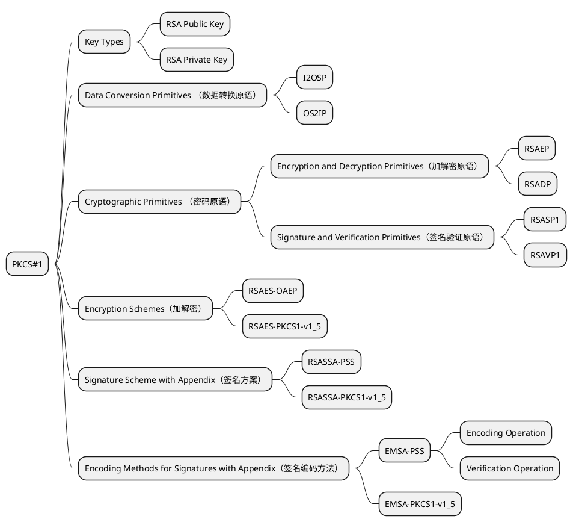
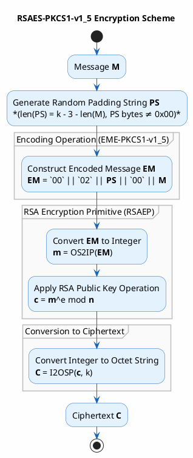

# 1.功能说明
我希望实现RSA 公钥加密，PKCS1.5填充
- 请给我一个实现流程
- 请给我一个实现代码示例

# 步骤
##  1. 生成私钥对
### 生成RSA 2048位私钥（已在README中存在）
openssl genpkey -algorithm RSA -out private_key.pem -pkeyopt rsa_keygen_bits:2048

### 从私钥中提取公钥（新增步骤）
openssl rsa -pubout -in private_key.pem -out public_key.pem

# 2. 编译加密程序
编译使用CMake，不要使用手动gcc
# 3. 运行加密程序

# 从私钥提取公钥
openssl rsa -in private_key.pem -pubout -out public_key.pem

